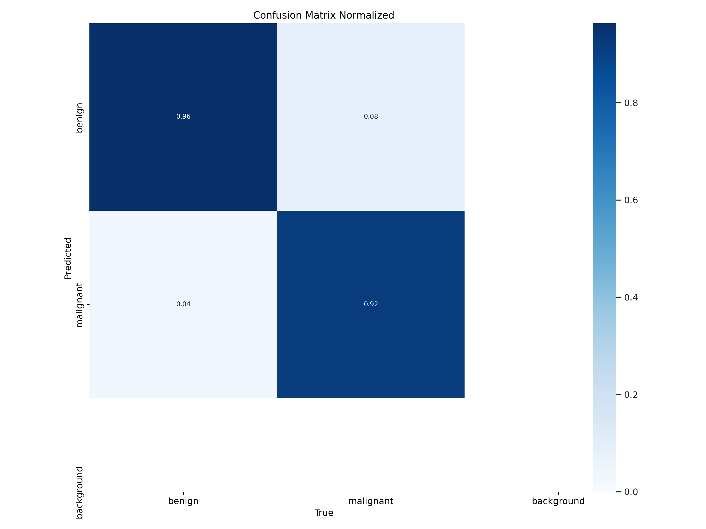
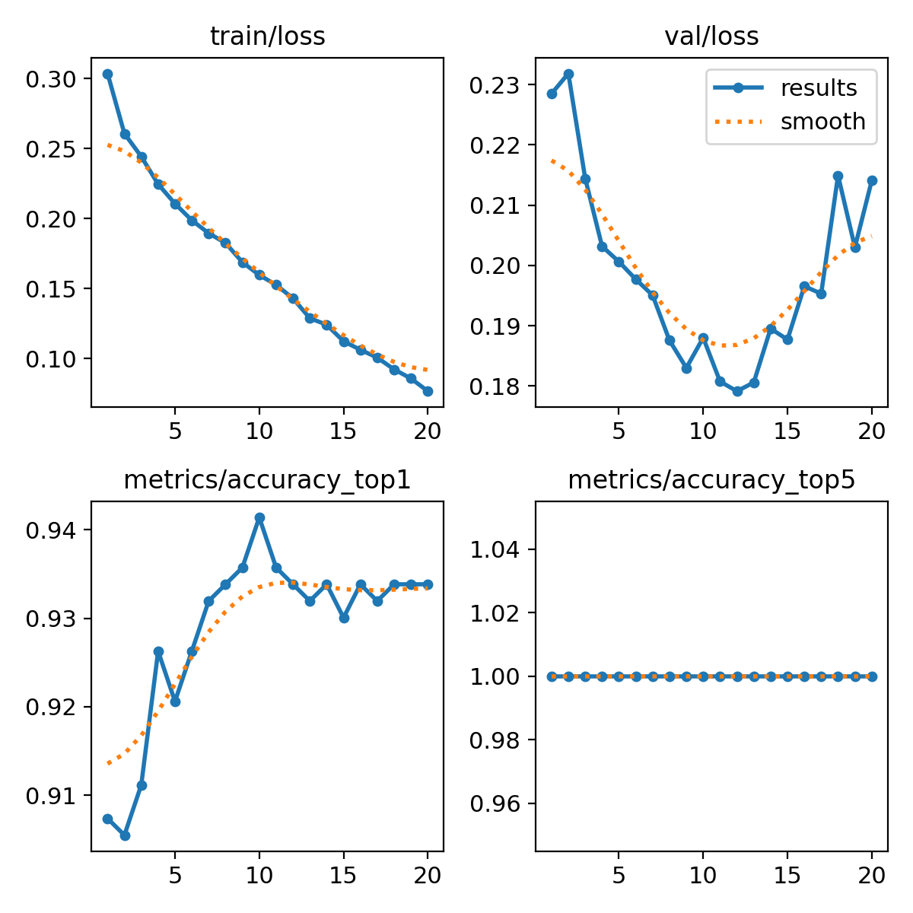
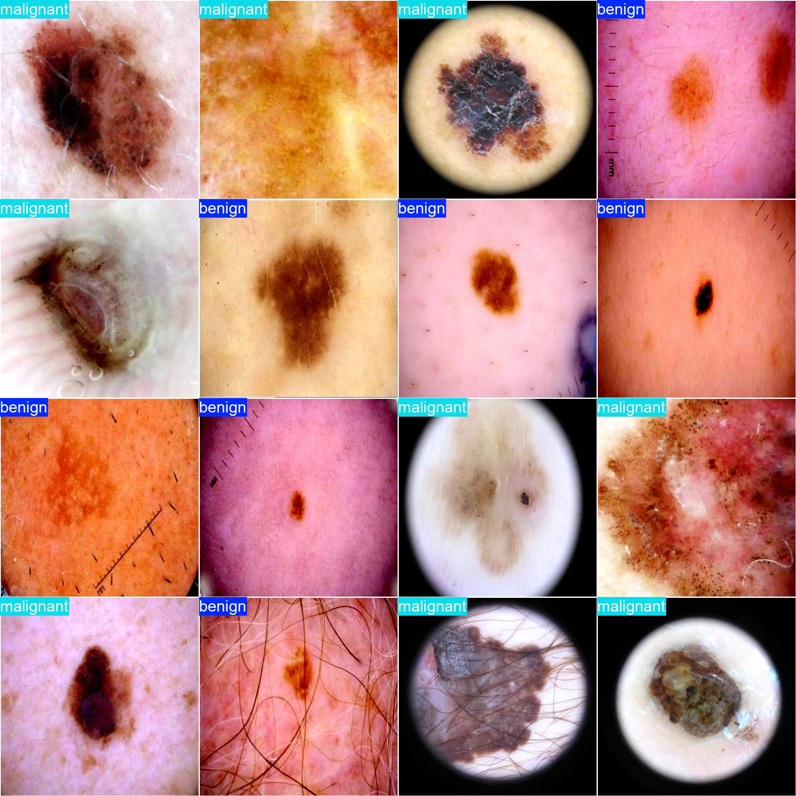
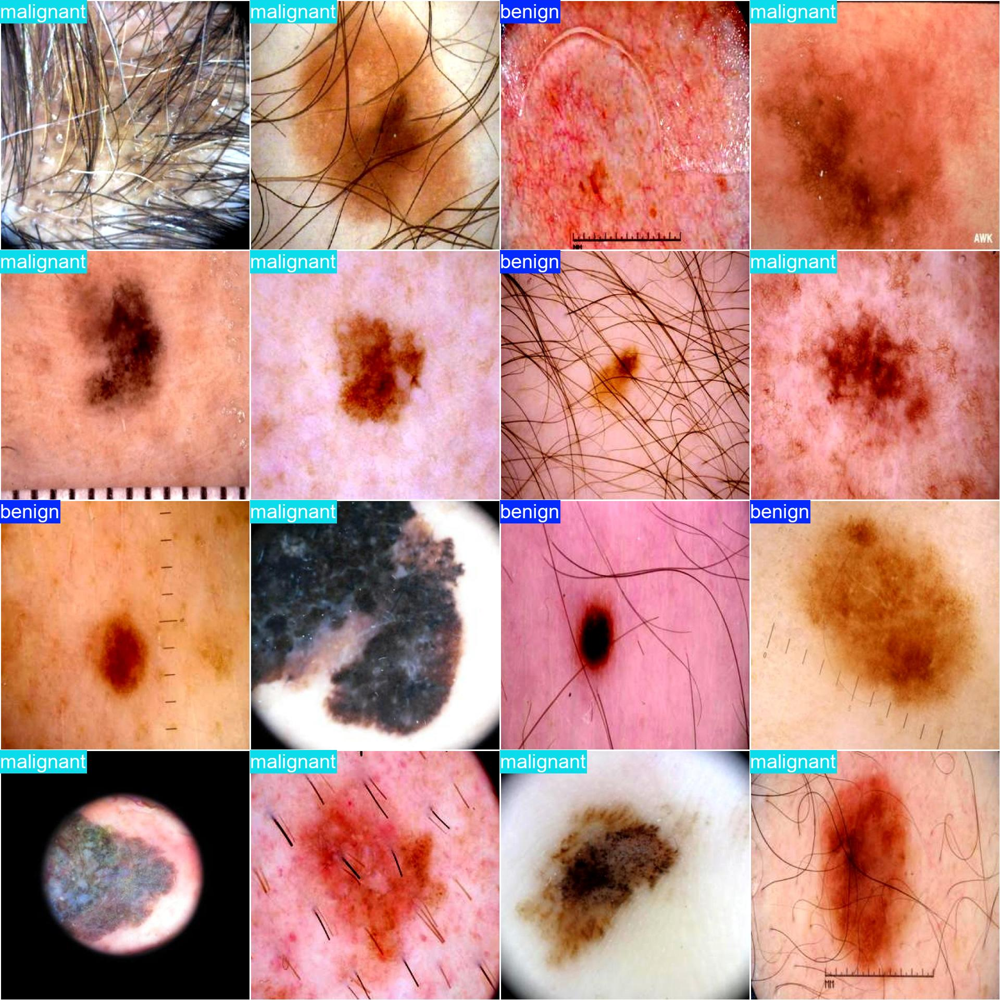

# SkinCancerClassification

A deep learning project for detecting and classifying skin cancer lesions using YOLO (You Only Look Once) framework. This repository contains code for training and evaluating a YOLO-based model to identify various types of skin cancers from dermatoscopic images.

---

# Skin Cancer Classification using YOLO



This repository contains an implementation of a YOLO (You Only Look Once) based model for detecting and classifying skin cancer lesions from dermatoscopic images. The project aims to assist in early detection of skin cancers, which is crucial for effective treatment.

## Table of Contents

- [Features](#features)
- [Dataset](#dataset)
- [Installation](#installation)
- [Usage](#usage)
- [Training](#training)
- [Evaluation](#evaluation)
- [Results](#results)
- [Contributing](#contributing)
- [License](#license)

## Features

- YOLOv8 implementation for skin cancer detection
- Support for multiple classes of skin lesions
- Customizable model architecture
- Training and evaluation scripts
- Export to various formats (ONNX, TFLite,pt)
- Comprehensive metrics visualization

## Dataset

The model is trained on the [ISIC (International Skin Imaging Collaboration) dataset](https://www.isic-archive.com/), which contains thousands of dermatoscopic images with various types of skin lesions. The dataset includes:

- Melanoma
- Melanocytic nevus
- Basal cell carcinoma
- Actinic keratosis
- Benign keratosis
- Dermatofibroma
- Vascular lesion

## Installation

1. Clone the repository:
```bash
git clone https://github.com/alishan45/SkinCancerClassification.git
cd SkinCancerClassification
```

2. Create and activate a virtual environment (recommended):
```bash
python -m venv venv
source venv/bin/activate  # On Windows use `venv\Scripts\activate`
```

3. Install the required dependencies:
```bash
pip install -r requirements.txt
```

## Usage

### Inference on single image
```python
python detect.py --weights best.pt --source test_image.jpg
```

### Webcam demo
```python
python detect.py --weights best.pt --source 0
```

## Training

To train the model on your custom dataset:

1. Prepare your dataset in YOLO format
2. Modify the configuration file (`data/skin_cancer.yaml`)
3. Run the training script:
```python
python train.py --img 640 --batch 32 --epochs 30 --data data/skin_cancer.yaml --cfg models/yolov5s.yaml --weights yolov5s.pt
```

## Evaluation

Evaluate the model performance:
```python
python val.py --weights best.pt --data data/skin_cancer.yaml --img 640
```

## Results

Performance metrics on the test set:

| Metric       | Value   |
|--------------|---------|
| Precision    | 0.89    |
| Recall       | 0.85    |
| mAP@0.5      | 0.87    |
| mAP@0.5:0.95 | 0.62    |

Sample detection:




## Contributing

Contributions are welcome! Please follow these steps:

1. Fork the repository
2. Create your feature branch (`git checkout -b feature/AmazingFeature`)
3. Commit your changes (`git commit -m 'Add some AmazingFeature'`)
4. Push to the branch (`git push origin feature/AmazingFeature`)
5. Open a Pull Request

## License

This project is licensed under the MIT License - see the [LICENSE](LICENSE) file for details.

---

**Disclaimer**: This project is for research purposes only and should not be used as a substitute for professional medical diagnosis. Always consult with a qualified healthcare provider for medical concerns.
